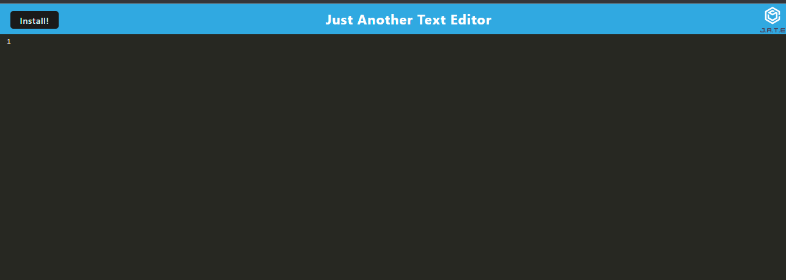

# Text Editor

## Description

This is  text editor that runs in the browser. The app  is a single-page application that meets the PWA criteria. Additionally, it ill features a number of data persistence techniques that serve as redundancy in case one of the options is not supported by the browser. The application also functions offline.

## Table of Contents
- [Installation](#installation)
- [Usage](#usage)
- [Credits](#credits)
- [License](#license)
- [Collaborators](#Collaborators)

## Installation
Current project has been saved in my personal GitHub repository and is currently available for cloning and reviews on:

https://github.com/Valllerian/Text-Editor-19

## Usage

Access the deployed app on: 

https://salty-wildwood-66812.herokuapp.com/

Main page of the app.

 

 

## Credits
Following resources  have been used while working on the project:

1) W3Schools has been used to get some more understanding on the code functionality, pseudo classes, img positioning etc:

    https://www.w3schools.com/

2) Following ReadMe Tutorial has helped me to write a proper, well-structured ReadMe file:

    https://coding-boot-camp.github.io/full-stack/github/professional-readme-guide

3) List of licenses:

    https://choosealicense.com/

## License
Current project is unlicensed. Which means - "Anyone is free to copy, modify, publish, use, compile, sell, or
distribute this software, either in source code form or as a compiled
binary, for any purpose, commercial or non-commercial, and by any
means." (Quote for source #3)

## Collaborators:

Valerii Bihun: valeriibihun.co@gmail.com;
